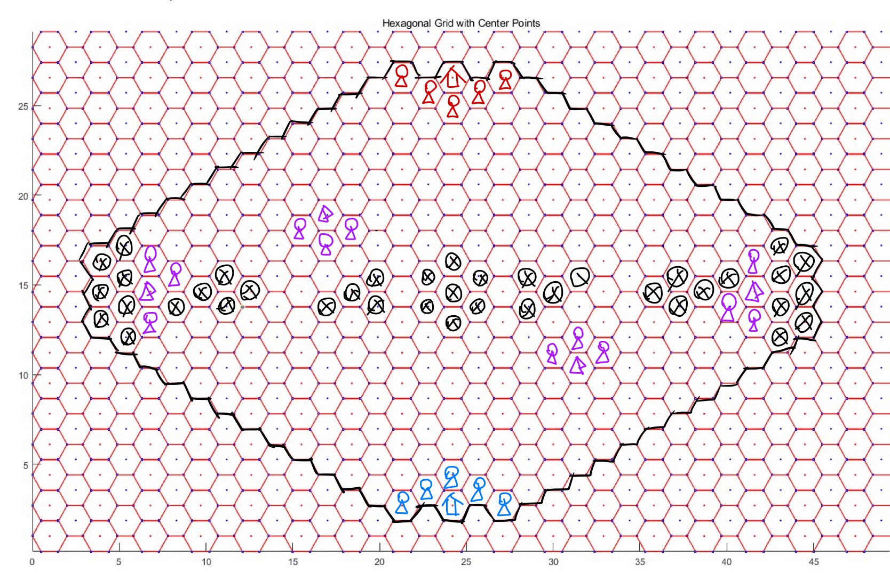
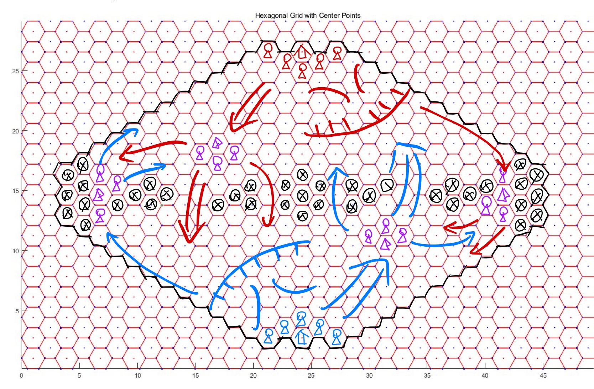

# 地图

**要素** ：

- 地图中心对称，但不轴对称
- 双方 **神迹** 在地图两侧，拥有5个 **初始出兵点**
- 地图上有4处 **驻扎点** （紫色帐篷），每个被 **占领** 的驻扎点提供 **3** 个 **额外出兵点**
- 任意一个 **出兵点** 5格内没有其他 **驻扎点** （游戏内最高速为 **5** ）
- 被黑色 $\otimes$ 标记的格子为 **深渊** 

## 神迹

双方 **神迹** 具有 *30* 生命上限，不会自然恢复

## 驻扎点

**驻扎点** 默认为中立。

每个回合开始，当一名 **非潜行** **地面生物** 位于一个 **驻扎点** 上方时，在本回合内，该 **驻扎点** 被 **该生物** 所属的一方占领。

在本回合内， **驻扎点** 的占领状态不会因为（用于占领的生物离开等）任何因素而改变。

被己方占领的 **驻扎点** 所控制的 **出兵点** 视为 **己方出兵点** 。

## 出兵点

**初始出兵点** 和 **额外出兵点** 统称 **出兵点** 。

每回合都可以在 **己方出兵点** 召唤生物，如果某个召唤行为会导致 **生物重叠** ，则不能进行召唤。

## 深渊

**深渊** 是一种特殊地形。

**地面生物** 无法经过或停留在 **深渊** 中，如果 **地面单位** 被 **强制位移** 并停留至 **深渊** 则立即死亡（但穿过不会）。

**空中生物** 可以自由经过和停留在 **深渊** 中。

# 基本机制

## 游戏流程

### 提交卡组

双方玩家提交自己的卡组，卡组包含 *1* 种 **神器** 和 *3* 种不同 **生物**

> 实际上由于不存在抽卡，可以理解为这些卡一开始就全在手牌里

不合法的卡组直接判负。

### 对局开始

公布双方卡组 。

进入 **先手玩家** 的回合，之后轮流进行回合。

## 法力值

游戏开始时， **先手玩家** 拥有 *1* **法力上限** ， **后手玩家** 拥有 *2* **法力上限**。

> 实际上，每个玩家的第一个回合也会增长法力上限，所以实际上双方玩家第一个回合法力上限为 *2/3*

召唤生物、使用神器都会消耗法力值。

**法力上限** 最高为 **12**

## 冷却

### 生物

每种生物在加入卡组后会提供若干个 **生物单元** 。

每个 **生物单元** 可以被 *独立地* 消耗，用于一次任意 **星级** 的该种生物召唤。

召唤出的 **生物** **死亡** 后，召唤其所消耗的 **生物单元** 会进入 **冷却** ， 冷却结束后才能再次用于召唤。

冷却所需回合数与生物 **种类** 和 **星级** 有关。

### 神器

**神器-回收** 后进入冷却，冷却结束后可再次使用。

**回收** 时机和 **冷却时间** 与神器有关。

## 玩家回合

双方玩家轮流进入 **回合** ，每个回合分为以下阶段：

### 回合开始

按顺序处理以下事件：

1. 当前玩家 **法力上限** 增大 **1** 
2. 当前玩家 **法力值** 设置为 **法力上限**
3. 当前玩家占领 **驻扎点**
4. 处理 **回合开始** 触发器（按入场先后顺序）

### 冷却阶段

己方 **生物单元** 和 **神器** **剩余冷却时间** 减少 1 。

**剩余冷却时间** 为 0 的 **生物单元** 和 **神器** 变为可用。

### 主要阶段

在该阶段，玩家可以进行以下操作：

- **召唤生物** 
- **生物-移动** 
- **生物-攻击** 
- **神器-使用** 

不限次数，不限顺序

### 回合结束

处理 **回合结束** 触发器（按入场先后顺序）

## 触发器【开发向】

含有 **触发** 词条的 **生物** 和 **神器** 以及 **触发式** 陷阱，需要 **安装** **触发器** ， 导致 **触发器** **安装** 的对象（生物/神器/陷阱）称为 **触发器** 的 **主体**。

**触发器** 安装后，存在于全局的 **触发器列表** 中，当事件发生时，按照安装的先后顺序依次检测 **触发器表** 中的 **触发器** 能否被触发，若能则执行触发效果。

当 **触发器** 的 **主体** 被 **销毁** 时，需要将其从列表中删除。

# 生物

## 生物单元

每种生物在加入卡组后会提供若干个 **生物单元** 。

每个 **生物单元** 可以被 *独立地* 消耗，用于一次任意 **星级** 的该种生物召唤。

召唤出的 **生物** **死亡** 后，召唤其所消耗的 **生物单元** 会进入 **冷却** ， 冷却结束后才能再次用于召唤。

冷却所需回合数与生物 **种类** 和 **星级** 有关。

## 星级

**生物** 拥有 **3** 个 **星级** 不同的版本，不同 **星级** 的生物拥有相似的定位和特性，但往往具有不同的 **基本属性** 。

**生物单元** 可以用于任意 **星级** 的该种生物召唤。

## 基本属性

生物拥有6种 **基本属性** —— **法力消耗** 、 **攻击力** 、 **攻击距离** 、 **最大生命值** 、 **最大行动力** 、 **冷却时间** 。

### 法力消耗

生物 **召唤** 时会消耗等同于 **法力消耗** 的 **法力值** 。

### 攻击力

决定生物 **攻击** 和 **反击** 造成的 **伤害**

### 最大生命值

生物 **生命值** 的最大值， **生物-召唤** 后， **初始生命值** 等于 **最大生命值** 。

受到 **治疗** 后，生命值不会超过最大生命值。

### 最大行动力

**生物-移动** 时，一条 **合法移动路径** 的最大格数。

**地面生物** 计算 **合法路径** 时，不能 **经过** 或 **停留** 于 **其他地面生物** 、**神迹** 、 **深渊** ；不能 **经过** 但能 **停留 ** 于 **敌方空中生物** 、 **敌方地面生物周围1格** 。

**空中生物** 计算 **合法路径** 时，不能 **经过** 或 **停留** 于 **其他空中生物** ；不能 **经过** 但能 **停留 ** 于 **敌方地面生物** 、 **敌方空中生物周围1格** 。

**路径** 的格子不包含移动前的位置。

**停留** 的格子即路径的最后一格。

**经过** 的格子不包含最后停留的格子。

> 可以理解为：每个生物 **占据** 某一格的某一层，这使得双方生物都不能经过/停留于该格该层。同时，每个生物 **拦截** 同层的周围6格和同格的另一层，这使得 **敌方生物** 不得经过这些区域，一旦走入就必须停止移动。
>
> 提示：间断（生物之间间隔1格）防线能很好地阻击敌方同层生物，同时减少生物消耗和增大攻击面积。但对于非同层生物仅能起到有限的拖延作用。

### 冷却时间

指 **生物-死亡** 后，对应 **生物单元** 重新可用前，需要经历的 **冷却阶段** 数。

## 相关操作

### 召唤

消耗 **法力值** 和 **对应生物槽含量** ，在指定位置，召唤一个指定 **种类** 和 **星级** 的生物。

1. 召唤声明（位置，**生物单元** ， **星级** ）[检验位置合法性、 **生物单元** 是否可用 和 **法力值** ]
2. 消耗 **法力值**
4. 消耗 **生物单元**
5. 创建生物
7. 安装 **触发器** （如果有）

### 攻击

让一个处于 **可攻击状态** 的 **生物（攻击者）** 对 **敌方生物/神迹（被攻击者）** 发起一次攻击。

**攻击者** 为 **可攻击状态** 当且仅当：

- **攻击者** **攻击力** > 0
- **攻击者** 非本回合 **召唤** （除非有特殊词条）
- **攻击者** 本回合未 **移动** 或 **攻击** （除非有特殊词条）
- **攻击者** 不处于一些导致无法攻击的状态中

**被攻击者** 为 **合法攻击目标** 当且仅当：

- **被攻击者** 与 **攻击者** 的距离（无视地形）在 **攻击者** 的 **攻击范围** 内
- **被攻击者** **生命值** > 0
- **被攻击者** 为 **空中生物** 时 **攻击者** 有 **飞行** 或 **对空** 词条
- **被攻击者** 不处于一些导致无法被攻击的状态中

攻击者会对被攻击者造成等同于攻击者攻击力的伤害。

被攻击者可以 **反击** ，当且仅当：

- **被攻击者** 与 **攻击者** 的距离（无视地形）在 **被攻击者** 的 **攻击范围** 内
- **被攻击者** **攻击力** > 0
- **攻击者** 为 **空中生物** 时 **被攻击者** 有 **飞行** 或 **对空** 词条
- **攻击者** 不处于一些导致无法被反击的状态中
- **被攻击者** 不处于一些导致无法反击的状态中

1. 攻击声明（攻击者，被攻击者）[检验攻击者合法性、攻击目标合法性]
2. 处理 **生物攻击时** 触发器
3. 如果 **攻击者** 生命值 <= 0 ，退出攻击
4. 锁定 **攻击目标** （即之后不再检验目标合法性）
5. 检验被攻击者 **反击** 合法性
6. 锁定 **反击目标** （即之后不再检验目标合法性）
7. **攻击者** 对 **被攻击者** 造成伤害
8. 如果 **攻击者** 无 **先攻** 词条，或者 **被攻击者** 当前生命 > 0，**被攻击者** 对 **攻击者** 造成伤害
9. 处理 **生物攻击后** 触发器
10. 处理 **生物反击后** 触发器

### 移动

让一个处于 **可移动状态** 的 **生物** 移动到指定地点。

**生物** 为 **可移动状态** 当且仅当：

- **最大行动力** > 0
- 非本回合 **召唤** （除非有特殊词条）
- 本回合未 **移动** 或 **攻击** （除非有特殊词条）
- 不处于一些导致无法移动的状态中

1. 移动声明（移动者，到达位置）[检验移动合法性（见 **最大行动力** ）]
2. 移动到 **目标位置**
3. 处理 **生物移动后** 触发器

## 死亡

### 生物销毁

1. 触发 **亡语**
2. 卸载 **触发器**
3. 进入 **冷却**
4. 从场上删除对象

### 死亡检索

在玩家每一个 **操作** 的最后，进行 **死亡检索** 。

1. 检查地图上是否存在 **生命值** <= 0 的 **生物** ，如果没有，结束 **死亡检索** 。
2. 将所有 **生命值** <= 0 的 **生物** 加入 **濒死队列** 。（一旦进入濒死队列，即使之后生命值恢复到0以上，仍然会被销毁）
3. 按顺序处理 **濒死队列** 中 **生物死亡时** 所能 **触发** 的 **触发器** 。
4. 销毁 **濒死队列** 中的所有 **生物**
5. 回到1. 

## 词条

### 长词条

#### 触发

各种触发器

#### 亡语

死亡时生效的触发器

### 短词条

#### 对空

可攻击 **攻击范围** 内的 **地面生物** 和**飞行生物**

#### **飞行**

是 **飞行生物** ，可攻击 **攻击范围** 内的 **地面生物** 和**飞行生物**

#### 迅捷

己方回合内，可以各进行一次 **攻击** 和 **移动** ，顺序任意

# 神器

## 基本属性

神器拥有基本属性： **法力消耗** 、 **冷却时间**  、 **使用方式** 。

### 法力消耗

**使用** 神器时需要消耗的 **法力值** 。

### 冷却时间

神器 **回收** 后直到变为 **可用** 所需经历的 **回合数**。

**回收** 时机由使用方式决定。

## 使用方式

神器有3种使用方式，每个神器的使用方式是固定的。

### 释放

类似魔法，当即使用，产生效果，立即 **回收**

1. 声明 **神器** ，选择 **目标** [检验神器可用性，目标合法性，法力值是否充足]
2. 消耗 **法力值**
3. 消耗 **神器**
4. 产生效果
5. **回收**

### 生成

当即使用，产生效果（可能没有即时效果）。

产生效果之后，会在目标地点生成一个 **神器生物** ，被看作生物。

**神器生物** 死亡后， **神器** 才 **回收** 。

1. 声明 **神器** ，选择 **目标** [检验神器可用性，目标合法性，法力值是否充足]
2. 消耗 **法力值**
3. 消耗 **神器**
4. 产生效果
5. 生成 **神器生物**
6. 安装 **神器生物** 的 **触发器**

### 装备

以友方生物为目标使用，使用后为目标生物增加 **属性** 、 **词条** 和 **触发器**

装备生物死亡后， **神器回收**

1. 声明 **神器** ，选择 **目标** [检验神器可用性，目标合法性，法力值是否充足]
2. 消耗 **法力值**
3. 消耗 **神器**
4. 获得 **属性加成**
5. 获得 **词条**
6. 获得并安装 **触发器**

# 库

## 生物库

费用/攻击/生命/最小范围-最大范围/行动力/冷却

> 攻击范围0表示不可攻击/反击，0-0表示可攻击与自身相同格子的生物

### 剑士

- 生物槽容量：4

#### L1

- 2/2/2/1-1/3/3

#### L2

- 4/4/4/1-1/3/3

#### L3

- 6/6/6/1-1/3/3

### 弓箭手

- 生物槽容量： 3

#### L1

- 2/1/1/2-4/3/4
- **对空**

#### L2

- 4/2/3/2-4/3/4
- **对空**

#### L3

- 6/3/5/2-4/3/4
- **对空**

### 黑蝙蝠

- 生物槽容量：4

#### L1

- 2/1/1/0-1/5/2
- **飞行**

#### L2

- 3/2/1/0-1/5/2
- **飞行**

#### L3

- 5/3/2/0-1/5/2
- **飞行**

### 牧师

- 生物槽容量：4

#### L1

- 2/0/2/0/3/4
- **触发** ： **回合结束** 时，(范围2) **友方生物** 回复 1 生命

#### L2

- 3/0/2/0/3/4
- **光环** ： (范围1) **友方生物** +1 攻击力

#### L3

- 5/0/3/0/3/5
- **触发** ： **回合结束** 时，(范围2) **友方生物** 回复 1 生命
- **光环** ： (范围1) **友方生物** +1 攻击力

### 火山之龙

- 生物槽容量： 3

#### L1

- 5/3/5/1-2/3/5
- **触发** ：**攻击** 后，对 （与目标距离1） 且 （与自身距离2） 的 **敌方生物** 造成 3 点伤害

#### L2

- 7/4/7/1-2/3/5
- **触发** ：**攻击** 后，对 （与目标距离1） 且 （与自身距离2） 的 **敌方生物** 造成 4 点伤害

#### L3

- 9/5/9/1-2/3/5
- **触发** ：**攻击** 后，对 （与目标距离1） 且 （与自身距离2） 的 **敌方生物** 造成 5 点伤害

> 相当于锥形攻击（攻击距离2目标不会溅射距离1目标），溅射伤害不享受攻击力加成

## 神器库

法力值/冷却

### （）的圣光之耀

- 6/6
- **使用**：任意地点
- 回复 (**目标地点** 范围2) 友方生物所有生命值，(**目标地点** 范围2) 友方生物 本回合内获得 +2 攻击。

### （）的地狱之火

- 8/6

- **生成** ： (神迹范围5 + 占领驻扎点范围3) \* 无地面生物
- **token** ： 8/8/1-1/3
- 使用时对 (目标范围2) 内 **敌方生物** 造成 2 伤害

### （）的阳炎之盾

- 6/6

- **装备**：友方生物
- +0/+4
- **圣盾**（抵消受到的第一次伤害，不可叠加）
- **触发** ： **回合开始** 时，获得 **圣盾**

# 作战策略示例

